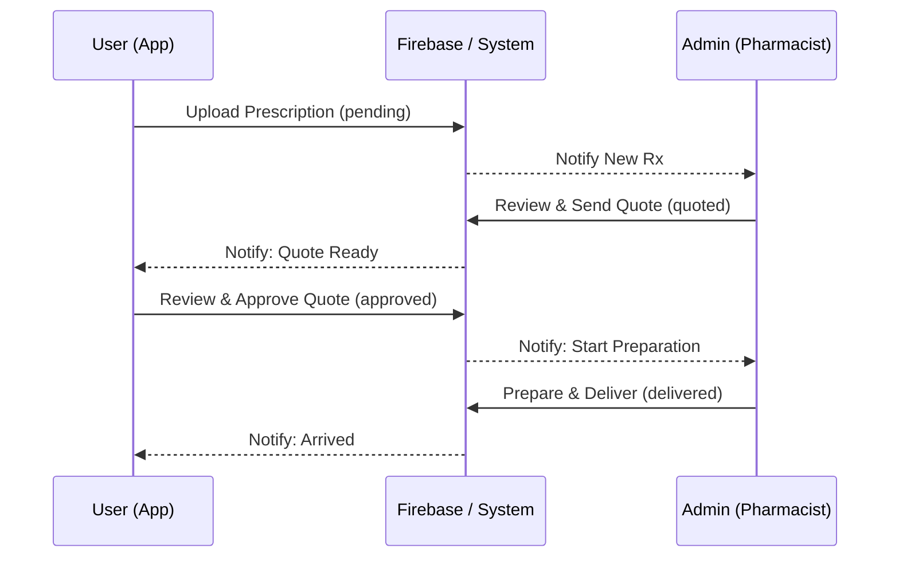
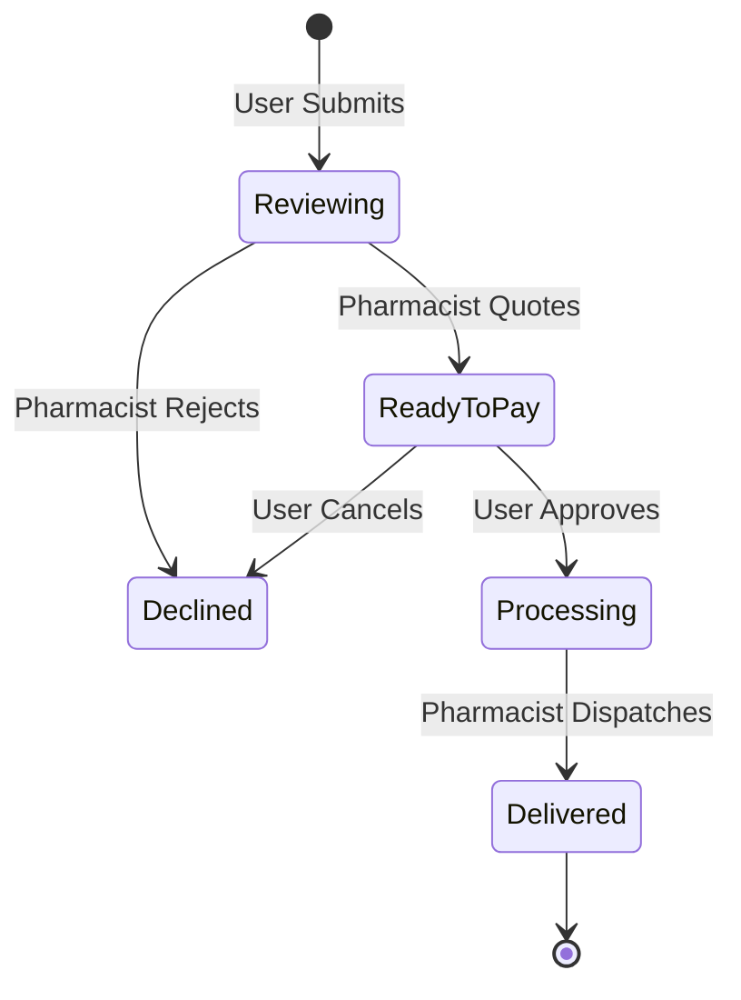

# 💊 Prescription Management Workflow

This document outlines the professional workflow for prescription processing within the Medicare application, designed for high-end healthcare service standards.

---

## 🔄 Interaction Flow (Sequence Diagram)

---

## 🚦 State Transitions (Flowchart)

---

## 📑 Lifecycle Overview

### 1. Submission (User)
*   **Action**: User uploads a photo of a physical prescription or types a medicine list.
*   **System State**: `pending`
*   **UI Label**: "Reviewing"

### 2. Quoting (Pharmacist)
*   **Action**: Pharmacist reviews the image, sets a price ($), and adds a note.
*   **System State**: `quoted`
*   **UI Label**: "Action Required" / "Ready to Pay"

### 3. Approval & Payment (User)
*   **Action**: User reviews the price and confirms the order.
*   **System State**: `approved`
*   **UI Label**: "Processing"

### 4. Fulfillment & Delivery (Pharmacist)
*   **Action**: Pharmacist préparer the order and marks as delivered once received.
*   **System State**: `delivered`
*   **UI Label**: "Delivered"

---

## 🎨 Professional Design Standards
*   **Color Palette**: Professional Blue and Emerald themes.
*   **Typography**: Clean, minimalist fonts for American tech standards.
*   **Icons**: Precise `Ionicons` for a premium healthcare feel.

